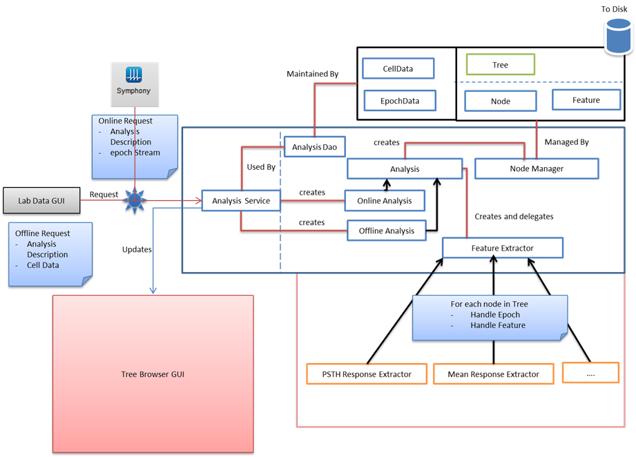

# Electrophysiology Data Analysis (In development)

## Architecture

## Clone

`git clone https://github.com/Schwartz-AlaLaurila-Labs/sa-labs-analysis-core.git --recursive`

**Note:** You must use the `--recursive` option to recursively clone all submodules.

## Usage

TODO

## Requirements

- Matlab 2016a+
